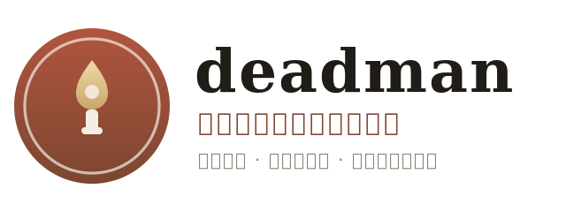
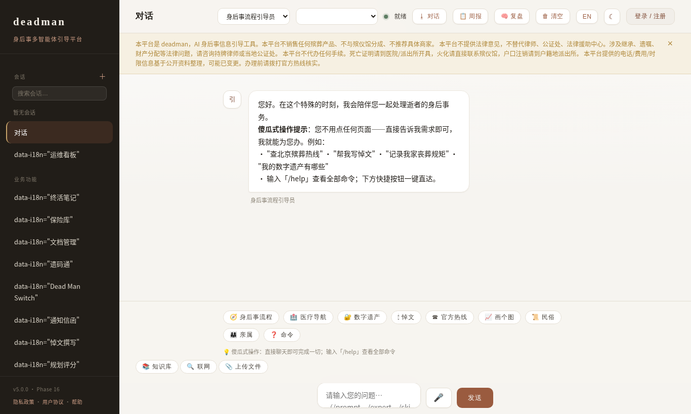
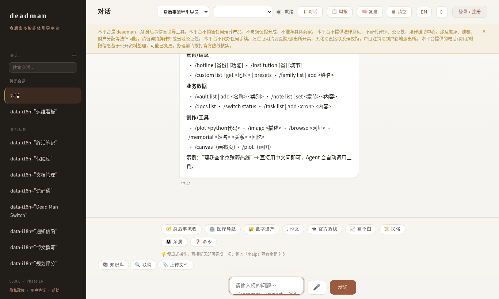
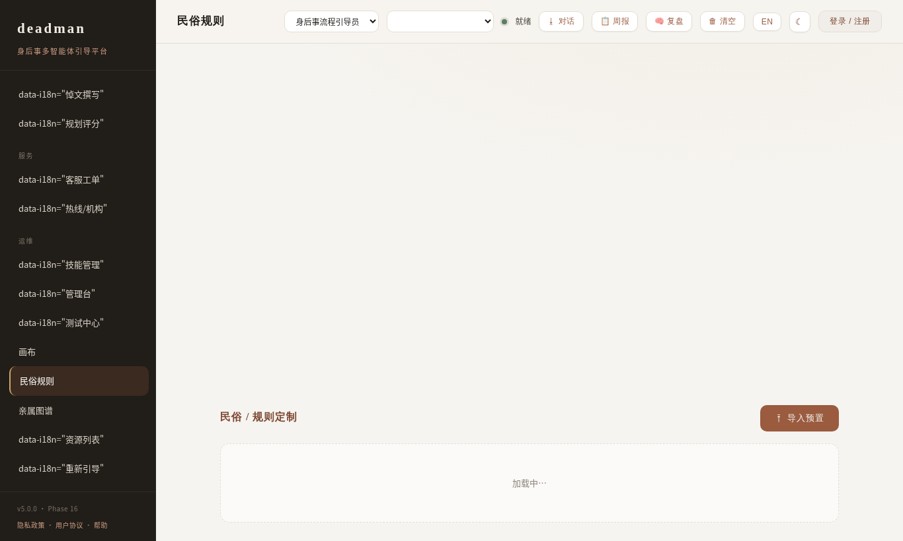
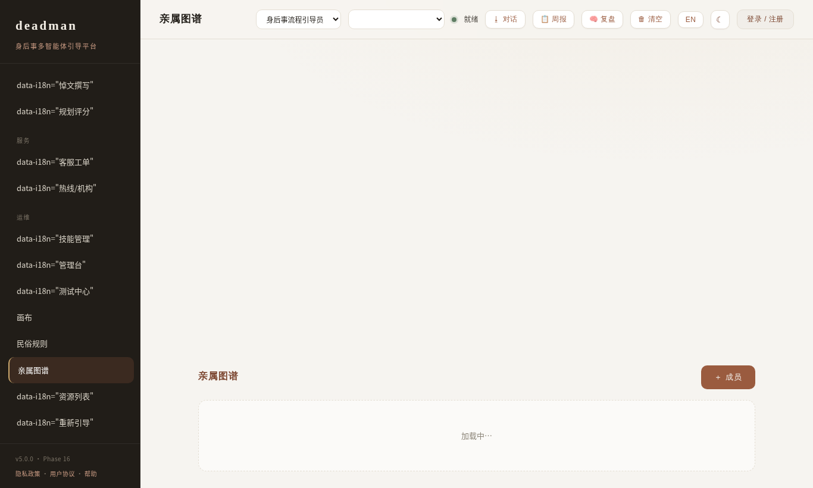
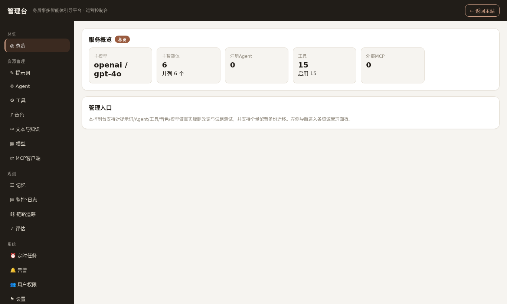
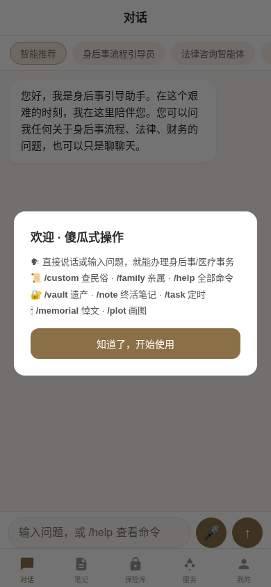

# deadman

<p align="center"></p>

<p align="center">
  <strong>An end-of-life preparation &amp; aftercare AI copilot</strong><br>
  Framework-agnostic 路 runs on any agent platform (OpenAI / Anthropic / DeepSeek / local models)
</p>

<p align="center">
  <a href="#"></a>
  <a href="README.zh-CN.md"></a>
  <a href="README.ja-JP.md"></a>
</p>

<p align="center">
  [](https://github.com/weed33834/deadman/actions/workflows/tests.yml)
  [](https://www.python.org/)
  [](LICENSE)
  [](CHANGELOG.md)
  []()
  []()
</p>

> **deadman** is a conversation-first AI copilot that walks families through **end-of-life preparation and after-death procedures** 鈥?wills &amp; digital legacy, funeral logistics, medical navigation, grief companionship, and more. **Type or speak your need and the agent guides you through it** 鈥?no need to click through pages. It also lets you **customize folk-custom rules** (funeral / wedding / memorial rituals) and visualize your **family tree (kinship graph)**.

> **For organizations (To B):** deadman ships as a **multi-tenant platform** 鈥?agencies (funeral services, insurance, legal, aftercare) get an **org workbench** (`/org`) with customers, cases, audit logs, knowledge base, team roles, **license-based licensing** (30-day trial, read-only on expiry), and **data export** (CSV/JSON/zip). Tenant data isolation via `resolve_tenant_path()` keeps every tenant's data separate.

---

## 鉁?Key Features

- 馃棧锔?**Conversation-first, foolproof UX** 鈥?every feature is invocable by chatting or voice (`/help` lists 25+ commands). First-run guide included.
- 馃 **After-death procedures** 鈥?9-step guidance, death certificate 鈫?estate settlement, across China's 34 provinces + US + JP.
- 馃彞 **Medical navigation** 鈥?medical insurance, critical-illness benefits, hospice care.
- 馃摐 **Folk-custom & rules engine** 鈥?import/customize regional funeral & wedding customs, **head-seven-to-seven (澶翠竷~涓冧竷)** memorial rituals.
- 馃懆鈥嶐煈┾€嶐煈?**Kinship graph** 鈥?build a family tree and render it as a visual **SVG kinship graph**.
- 馃攼 **Digital legacy & vault** 鈥?encrypted asset register, beneficiary assignment, handover plans.
- 馃暞 **Memorial writer** 鈥?AI-generated eulogy / obituary / thank-you note / epitaph.
- 馃 **Awareness & crisis guard** 鈥?intent recognition + safety intervention (L0).
- 馃洜 **Universal agent capabilities** 鈥?10-layer architecture: LLM adapters (OpenAI/Anthropic/DeepSeek/Qwen/Zhipu/Ollama鈥?, RAG + knowledge base, MCP server & client, sandboxed code execution + charts, voice (ASR/TTS), file parsing (PDF/Word/Image), export (MD/Word/PDF), image generation, web browsing, scheduled tasks, IAM, i18n, trace viewer, alerts, and a full **admin console**.
- 馃寪 **Multi-language** 鈥?English / 涓枃 / 鏃ユ湰瑾?UI (i18n).

## 馃枼 Screenshots

AI-driven live captures of the real interface. Full demo video: `docs/screenshots/demo.webm`.

| | |
|---|---|
|  |  |
| **Conversation-first chat** | **/help & 25+ commands** |
|  |  |
| **Folk-custom rules** | **Kinship graph visualization** |
|  |  |
| **Admin console** | **Mobile /m** |

## 馃殌 Quick Start

```bash
git clone https://github.com/weed33834/deadman.git
cd deadman
pip install -e .[all]            # or minimal: pip install -e .

# configure LLM
cp .env.example .env
# edit .env: LLM_PROVIDER=openai  LLM_MODEL=gpt-4o  LLM_API_KEY=sk-...

# start the web app (conversation-first UI + admin console)
uvicorn deadman.web.app:app --host 0.0.0.0 --port 8002
```

Open `http://localhost:8002` 鈥?the chat is the primary interface. The admin console is at `/admin`.

### Run tests

```bash
python -m pytest            # 3095 passed
```

## 馃棬 Conversation Commands

Type or speak any of these in the chat (also available on mobile `/m`):

| Category | Commands |
|---|---|
| Config | `/prompt` `/expert` `/skill` |
| Info | `/hotline` `/institution` `/custom` `/family` |
| Business | `/vault` `/note` `/docs` `/switch` `/task` `/cases` `/letters` `/score` `/support` |
| Create | `/memorial` `/plot` `/image` `/browse` `/canvas` |
| Help | `/help` `/manual` |

> Or just ask in natural language 鈥?e.g. "How to claim funeral allowance in Beijing?" or "Write a eulogy for my father who loved reading."

## 馃彈 Architecture

10-layer architecture (see `docs/`):

| Layer | Stack |
|---|---|
| L1 LLM | OpenAI / Anthropic / DeepSeek / Qwen / Zhipu / Ollama / vLLM |
| L2 Interface | retry 路 fallback 路 streaming 路 token tracking |
| L3 Prompt | role templates 路 rules (L0鈥揕8) 路 output parsing |
| L4 Agent | LangGraph 路 ReAct 路 reflexion 路 termination conditions |
| L5 Tools | MCP server & client 路 sandbox code execution 路 tool registry |
| L6 Memory | working/episodic/semantic/procedural 路 vector store 路 knowledge graph |
| L7 Orchestration | multi-agent 路 handoff 路 planner 路 debate |
| L8 API | FastAPI 路 SSE streaming 路 auth 路 rate limit |
| L9 Frontend | chat-first SPA 路 mobile `/m` 路 admin console |
| L10 Infra | Docker 路 monitoring 路 tracing 路 IAM 路 i18n 路 alerts |

## 馃摎 Documentation

- [CHANGELOG](CHANGELOG.md) 路 [SECURITY](SECURITY.md) 路 [CONTRIBUTING](CONTRIBUTING.md)
- [Admin & features](docs/ADMIN.md) 路 [Conversation commands](docs/CHAT_COMMANDS.md) 路 [Deployment](docs/DEPLOYMENT.md) 路 [Quick Start](docs/QUICKSTART.md)
- [Brand / Logo](BRAND.md) 路 [Platforms](PLATFORMS.md)

## 馃攳 Discoverability

**Topics / keywords**: `end-of-life` 路 `funeral` 路 `aftercare` 路 `digital legacy` 路 `grief support` 路 `medical navigation` 路 `folk customs` 路 `kinship graph` 路 `multi-agent` 路 `LLM` 路 `RAG` 路 `MCP` 路 `LangGraph` 路 `FastAPI` 路 `conversational AI` 路 `voice AI`

To make this repo easy to find, add these as **repository topics/tags** on GitHub/GitCode/Gitee.

## 馃摝 Architecture Highlights (v5.4)

- **Conversation-first**: everything invocable from chat (25+ commands + voice + natural language).
- **Folk-custom & kinship**: `/custom` rules engine + `/family` SVG kinship graph.
- **Universal agent stack**: MCP client, sandbox charts, file parsing, export, image gen, scheduled tasks, IAM, i18n, traces, alerts, error codes.
- **10-layer clean architecture**, `3095` passing tests, zero shells.

## License

Apache-2.0 鈥?see [LICENSE](LICENSE).

---

*Made with care for families navigating life's hardest moments.*
